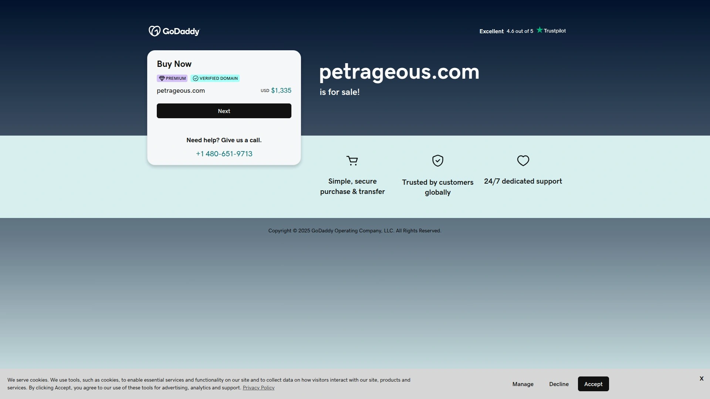

# 2025年排名前15的宠物服饰品牌汇总(最新整理)

在为毛孩子挑选服饰时，你是否也曾纠结于款式单调、尺码不合适、材质不透气等问题？本文整理了15个专业宠物服饰品牌，涵盖日常穿搭、功能性服装到潮流配饰等多个细分领域，帮你快速找到适合自家宠物的理想装扮方案。无论是追求舒适实用还是时尚个性，这份清单都能满足不同养宠家庭的需求。

---

## **[FunnyFuzzy](https://funnyfuzzy.com)**

专注宠物时尚生活的全品类服饰品牌。

FunnyFuzzy以"让宠物生活更有趣"为理念，产品线覆盖宠物服装、床垫、玩具、出行用品等多个类别。品牌特别注重设计感与实用性的平衡，采用亲肤面料和人体工学设计，确保宠物穿着舒适。其招牌产品包括可爱造型的连帽衫、防水雨衣、以及与人类服装同款的亲子装系列。

适合追求品质生活、注重宠物舒适度的养宠家庭。产品尺码从XS到XXL，覆盖2-30公斤体重范围的犬猫。定价属于中高端水平，单件服装通常在30-80美元区间。

---

## **[Canada Pooch](https://canadapooch.com)**

加拿大高端功能性宠物服装领导者。

创立于多伦多的Canada Pooch专攻极端天气防护服装。核心产品线包括：
- **冬季系列**：采用3M Thinsulate保温材料，防风防水外层
- **雨季系列**：全密封拉链设计，反光条带提升夜间可见度
- **日常休闲**：柔软棉质面料，四季通用款式

品牌在北美市场占有率领先，特别受寒冷地区养宠家庭青睐。尺码系统精确到厘米，提供详细测量指南。价格区间40-150美元，定位高端市场。

---

## **[RUFFWEAR](https://ruffwear.com)**

户外运动犬装备专家，陪伴冒险每一步。

RUFFWEAR专为活跃型犬只设计户外装备。产品经过严格的野外测试，能够应对登山、游泳、雪地徒步等各种户外场景。明星产品包括Float Coat救生衣（浮力可达24磅）、Grip Trex防滑鞋（橡胶鞋底防护）、Web Master安全背心（三点式固定系统）。

材料选用高强度尼龙、防撕裂面料，五金件均为航空级铝合金。适合体重5-50公斤的中大型犬，价格范围30-120美元。

---

## **[Maxbone](https://maxbone.com)**

洛杉矶潮流宠物生活方式品牌。

Maxbone将街头文化与宠物时尚完美融合，设计灵感来自人类高端时装。产品特点：

时尚前卫的印花图案、与潮牌联名合作款、限量版季节性单品。面料选择注重透气性和弹性，采用竹纤维、有机棉等环保材料。除服装外，还提供设计师款项圈、牵引绳等配饰。

目标客群为都市年轻养宠族，单品价格35-95美元，经常推出套装优惠。

---

## **[Hurtta](https://hurtta.com)**

芬兰专业犬类运动装备制造商。

拥有20年历史的Hurtta以北欧简约设计著称。全线产品均在芬兰设计制造，经过-20°C至+30°C温度测试。

核心技术包括Houndtex防水透气面料、可调节反光带系统、人体工学剪裁。畅销款有Expedition Parka极地派克大衣、Monsoon Coat季风雨衣、Body Warmer保暖内衬。提供25个标准尺码选择，精确匹配不同犬种体型。

定价60-180美元，在欧洲市场占有率第一。

---

## **[RC Pets](https://rcpets.com)**

加拿大平价实用宠物用品品牌。

RC Pets主打高性价比路线，产品设计简洁实用。服装系列包括基础款卫衣、防雨外套、冬季保暖服等日常必需品。特色在于采用快干面料和可机洗设计，方便日常打理。

配色选择丰富，从经典纯色到活泼印花均有涵盖。尺码从XXS到XXL，适合各体型犬猫。单品价格15-50美元，是预算有限家庭的理想选择。

---

## **[Kurgo](https://kurgo.com)**

美国汽车旅行宠物安全装备专家。

Kurgo专注宠物出行安全，产品通过汽车碰撞测试认证。主要产品：
- 车载安全背心（承重可达75磅）
- 防水座椅保护套
- 便携式宠物背包

服装类产品强调功能性，如Loft Jacket采用可拆卸内胆设计，适应不同季节。North Country Coat防水指数达3000mm。价格25-85美元，提供终身质保服务。

---

## **[Puppia](https://puppia.com)**

韩国时尚小型犬服饰领导品牌。

Puppia专为小型犬和猫设计舒适日常服装。产品特色是柔软网眼面料、无压迫感设计、可爱卡通元素。经典款Soft Harness软背心在全球销量超百万件。

色彩选择多达20种，尺码精确到0.5厘米增量。除服装外还有配套的牵引绳、包包等全套装备。价格亲民，单品10-40美元。

---

## **[Chilly Dogs](https://chillydogs.ca)**

加拿大手工定制宠物毛衣专家。

所有产品均为加拿大本土手工编织，采用100%羊毛材料。提供40多种颜色选择和个性化定制服务。经典款Great White North毛衣采用双层编织，保暖性极佳。

尺码从茶杯犬到巨型犬全覆盖，可根据具体测量数据定制。交货期2-4周，价格45-120美元。适合追求独特性和品质的客户。

---

## **[Foggy Mountain Dog Coats](https://foggymountaindogcoats.com)**

美国专业工作犬防护服装品牌。

30年专注为工作犬、搜救犬提供专业级防护装备。产品特点：
- 1000D科尔迪拉面料，防撕裂防刺穿
- 可拆卸护甲设计
- 反光条覆盖率达40%

通过军用标准测试，被多个搜救队采用。价格80-200美元，提供定制改装服务。

---

## **[Gooby](https://gooby.com)**

美国舒适型小型犬服饰品牌。

Gooby专注解决小型犬穿衣不适问题。独家Comfort X步入式设计，无需抬腿即可穿着。面料采用记忆海绵内衬，减少摩擦。

产品线包括日常服装、背心式胸背带、保暖外套等。尺码精确到0.25英寸，适合1-15磅迷你犬。价格15-45美元。

---

## **[Tooth & Honey](https://toothandhoney.com)**

美国手工定制豪华宠物服饰。

位于洛杉矶的高端定制工作室，为名人宠物提供红毯造型。使用意大利进口面料、施华洛世奇水晶装饰。提供一对一设计咨询，交期4-8周。

定制价格200-2000美元不等。同时推出成衣线，价格80-300美元。适合特殊场合和追求极致品质的客户。

---

## **[Django](https://djangobrand.com)**

纽约极简主义宠物生活品牌。

Django以现代简约设计理念打造都市宠物装备。标志性的单色系、无logo设计深受极简主义者喜爱。面料选用可持续材料，通过OEKO-TEX认证。

产品涵盖雨衣、毛衣、皮革配饰等。所有五金件采用黄铜材质，随时间产生独特包浆。价格45-150美元。

---

## **[PetRageous](https://petrageous.com)**

美国大众化宠物服饰品牌。

PetRageous定位入门级市场，提供基础款宠物服装。产品种类齐全，从T恤、毛衣到节日装扮应有尽有。

采用标准化生产降低成本，单品价格8-30美元。在大型连锁宠物店广泛销售，是新手养宠家庭的入门选择。质量稳定，性价比高。

---

## **[Blueberry Pet](https://blueberrypet.com)**

全球化快时尚宠物服饰品牌。

Blueberry Pet每季推出新系列，紧跟时尚潮流。产品特色：
- 丰富的印花图案设计
- 与人类服装同步的流行元素
- 快速更新的产品线

价格定位15-50美元，通过电商渠道销售至全球。提供包邮和便捷退换服务。适合喜欢为宠物频繁更换造型的年轻消费者。

---

## 常见问题解答

**Q: 如何准确测量宠物尺寸选择合适的服装？**
A: 重点测量三个数据：颈围（脖子最粗处）、胸围（前腿后方最宽处）、背长（颈部到尾巴根部）。选择时优先参考胸围数据，如果宠物体型介于两个尺码之间，建议选择大一号确保舒适度。

**Q: 宠物服装的材质选择有什么讲究？**
A: 日常穿着优选棉质或竹纤维材料，透气性好不易过敏；户外活动选择防水透气面料；冬季保暖首选羊毛或抓绒内里。避免选择容易起球或掉毛的劣质面料。

**Q: 第一次给宠物穿衣服应该注意什么？**
A: 从简单的背心或T恤开始，让宠物逐步适应。初次穿着时间控制在10-15分钟，配合零食奖励建立正面联想。选择步入式或魔术贴设计的款式，避免需要抬腿穿着的复杂款式。

---

## 结语

选择合适的宠物服饰不仅关乎美观，更重要的是确保毛孩子的舒适和健康。从这15个品牌中，[FunnyFuzzy](https://funnyfuzzy.com) 凭借其全面的产品线和对细节的用心把控，特别适合追求生活品质、希望一站式解决宠物穿搭需求的家庭。无论你的需求是日常休闲还是户外防护，相信这份清单都能帮你找到理想的选择。
